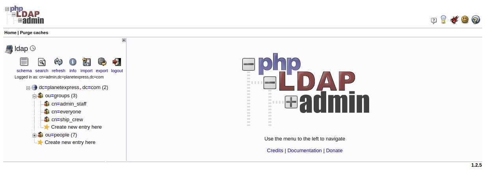
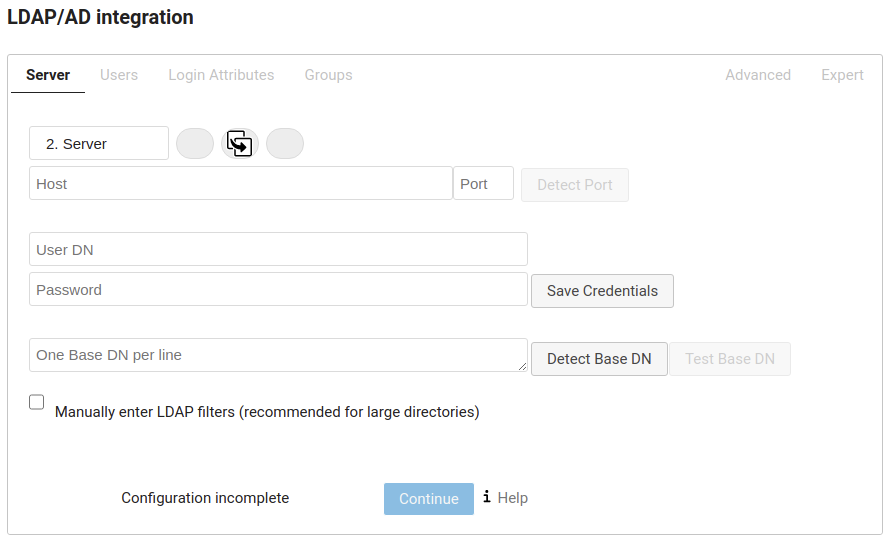
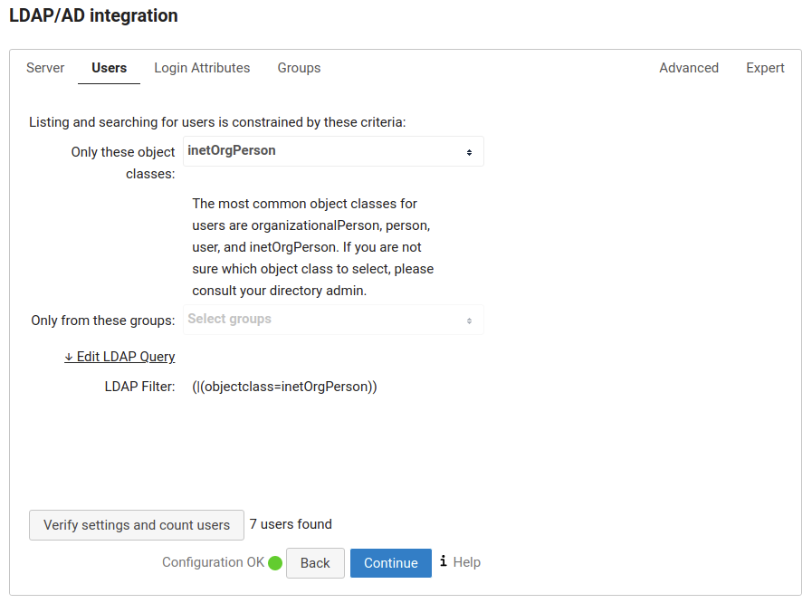
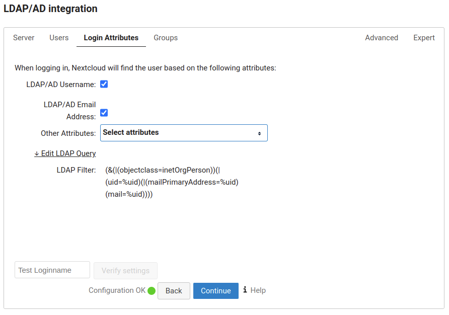
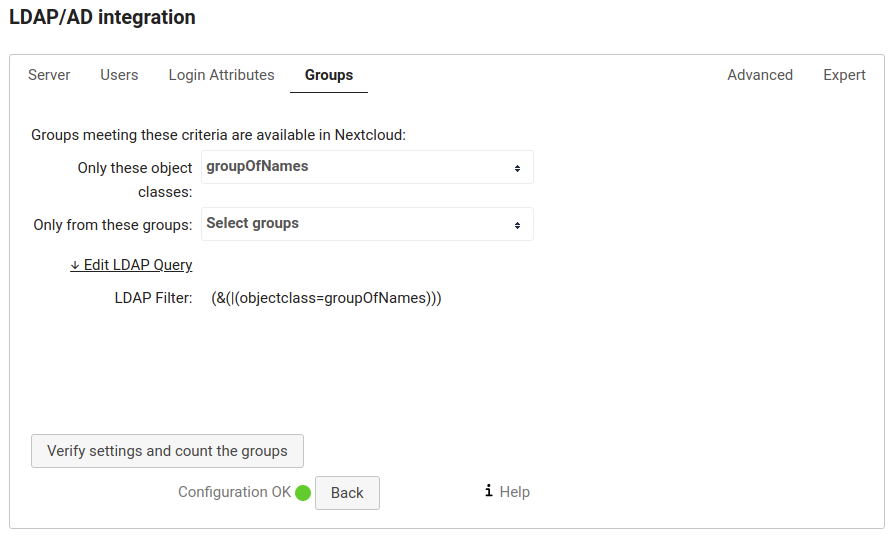
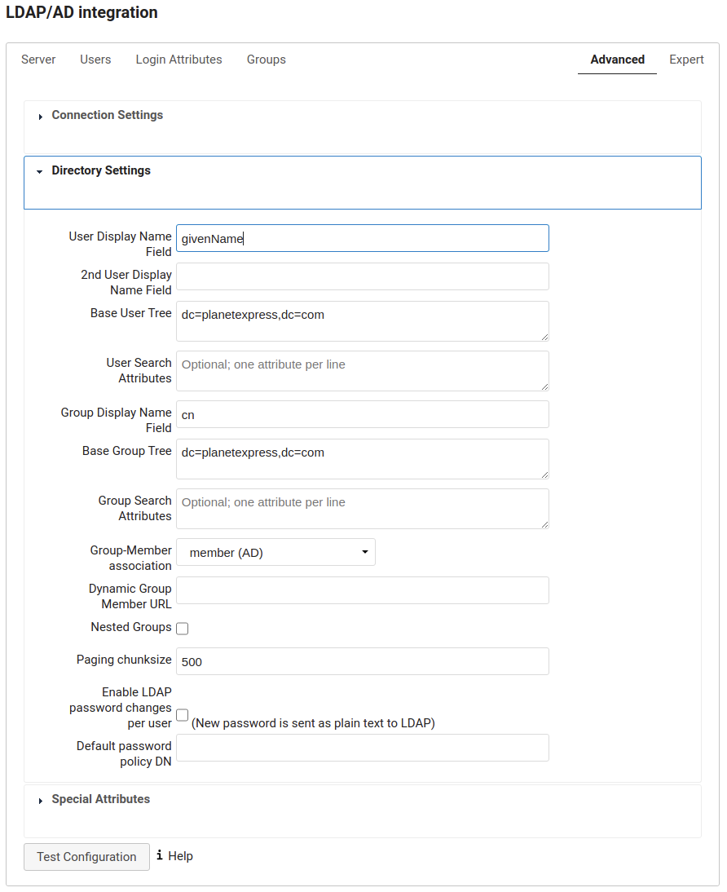
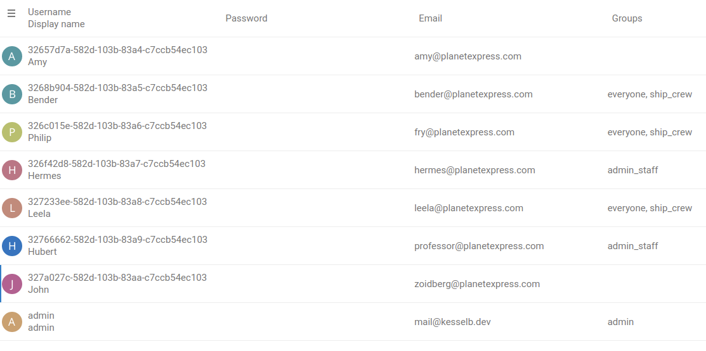
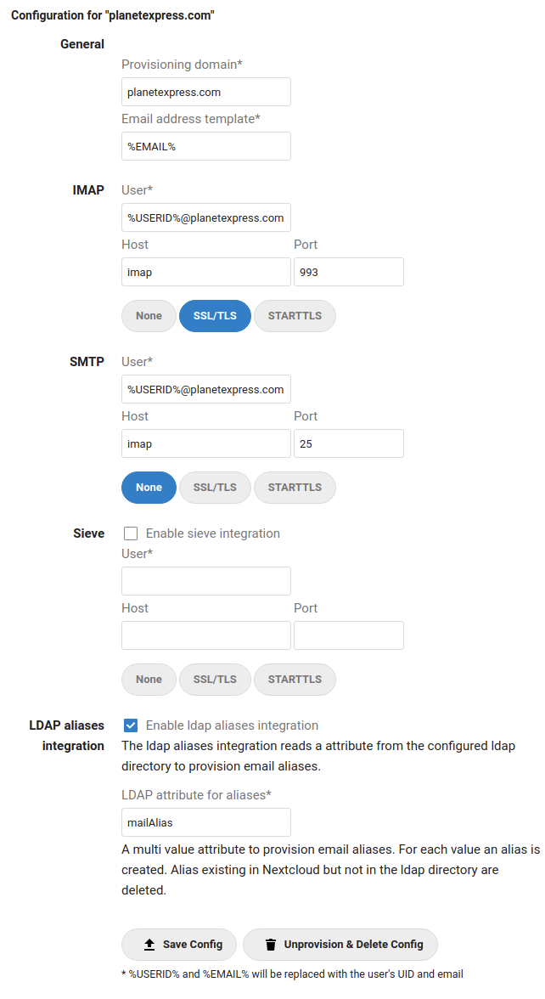

# Nextcloud Mail Developer Documentation

## Resetting the app
Connect to your database and run the following commands (`oc_` is the default table prefix):
```sql
DELETE FROM oc_appconfig WHERE appid = 'mail';
DELETE FROM oc_migrations WHERE app = 'mail';
DROP TABLE oc_mail_accounts;
DROP TABLE oc_mail_aliases;
DROP TABLE oc_mail_coll_addresses;
DROP TABLE oc_mail_attachments;
DROP TABLE oc_mail_mailboxes;
DROP TABLE oc_mail_messages;
DROP TABLE oc_mail_recipients;
DROP TABLE oc_mail_classifiers;
DROP TABLE oc_mail_trusted_senders;
DROP TABLE oc_mail_tags;
DROP TABLE oc_mail_message_tags;
```

## Testing LDAP aliases provisioning

Testing the ldap aliases provisioning requires:

1. LDAP service configured in Nextcloud
2. IMAP service using LDAP for authentication
3. A provisioning configuration for Mail

### LDAP service configured in Nextcloud

The fastest way to setup Nextcloud with LDAP is https://github.com/juliushaertl/nextcloud-docker-dev.

It's still possible to integrate a ldap service into your own
development setup with docker-compose.

```
ldap:
  image: osixia/openldap:1.5.0
  command: --copy-service --loglevel debug
  ports:
    - 50003:389
  volumes:
    - ./ldap:/container/service/slapd/assets/config/bootstrap/ldif/custom
  environment:
    LDAP_DOMAIN: planetexpress.com
	LDAP_BASE_DN: dc=planetexpress,dc=com

ldapadmin:
  image: osixia/phpldapadmin:0.9.0
  ports:
    - 50004:443
  environment:
    - PHPLDAPADMIN_LDAP_HOSTS=ldap
```

To have sample users we are using https://github.com/juliushaertl/nextcloud-docker-dev/tree/master/data/ldap.
- Download the directory and save it in the same directory as docker-compose.yml.
- Delete 99_others.ldif (otherwise you have a lot of additional test users).
- Adjust the port mapping for your use case if necessary.

Run docker-compose to start ldap and ldapadmin.
Visit ldapadmin at http://localhost:50004 (or whatever port you configured) and try to login with

- user: cn=admin,dc=planetexpress,dc=com
- password: admin



Next step is to configure our LDAP service in Nextcloud.
- Login as administrator
- Go to apps and enable "LDAP user and group backend"
- Go to settings -> LDAP/AD integration



- Host: the address of your LDAP server
- Port: 389 mostly
- User DN: cn=admin,dc=planetexpress,dc=com
- Password: admin
- One Base DN per line: dc=planetexpress,dc=com

Click Test Base DN to test the configuration.



- Only these object classes: inetOrgPerson

Click Verfiy settings and count users.



- Check LDAP/AD Username
- Check LDAP/AD Email Address



- Only these object classes: groupOfNames



- User Display Name Field: givenName

### IMAP service using LDAP for authentication

In a production environment we would configure our IMAP service
to authenticate against the LDAP service. For our testing scenario it's
sufficient to configure some LDAP accounts on the IMAP service.

```
imap:
  image: christophwurst/imap-devel:latest
  ports:
    - 25:25
    - 143:143
    - 993:993
    - 4190:4190
  environment:
    - MAILNAME=mail.domain.tld
    - MAIL_ACCOUNTS=admin@test.local,password 3268b904-582d-103b-83a5-c7ccb54ec103@planetexpress.com,bender 32657d7a-582d-103b-83a4-c7ccb54ec103@planetexpress.com,amy
```

Extend our docker-compose.yml and add the imap test image.
Use the MAIL_ACCOUNTS environment variable to create test accounts for IMAP.




3268b904-582d-103b-83a5-c7ccb54ec103@planetexpress.com is the username for
the user in the LDAP directory. The username might be different on your setup.
Please lookup the right values in the Nextcloud user management.

To create a IMAP account for Amy and Bender add to MAIL_ACCOUNTS.

`32657d7a-582d-103b-83a4-c7ccb54ec103,amy 3268b904-582d-103b-83a5-c7ccb54ec103,bender`

The password is (for our sample data) the display name in lowercase.
Note that accounts are seperated by a space.

### A provisioning configuration for Mail



The above configuration will query the mailAlias attribute for each user
and use it to create and delete aliases.

Our sample data for LDAP does not contain mailAlias. To add one or more mailAliases
to a user:
- Visit ldapadmin
- Expand dc=planetexpress,dc=com
- Expand ou=people
- Pick a user (e.g Bender)
- Look for objectClass -> Click add value -> Select PostfixBookMailAccount -> Click Add new ObjectClass
- Click Add new attribute -> Select mailAlias -> Enter rodriquez@planetexpress.com -> Press Enter -> Click Update Object

Now login to Nextcloud as Bender and go to Mail. See rodriquez@planetexpress.com
as Alias in the Account settings for the provisoned mail account.

